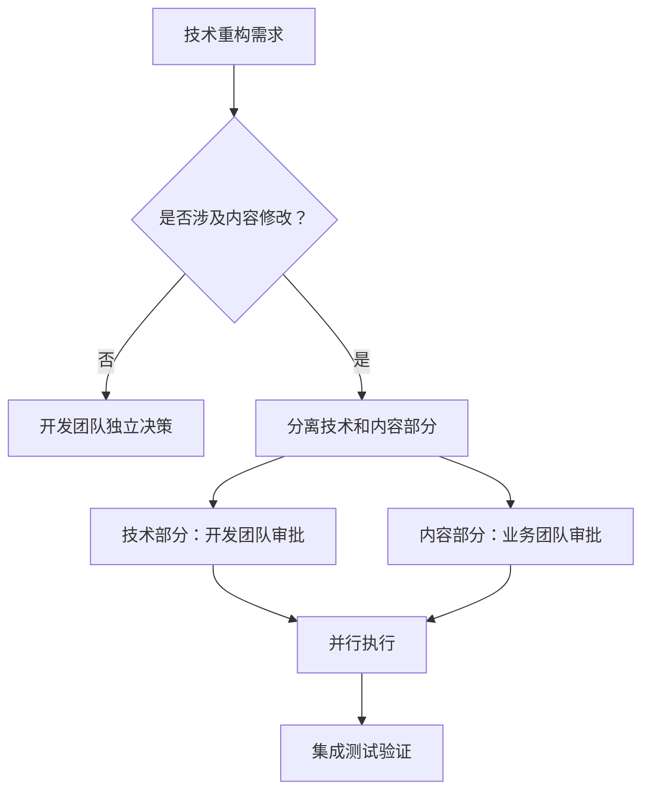

# 架构治理 - 技术/内容变更边界规范

## 文档目的
本文档定义了在系统重构和功能开发过程中，技术变更和业务内容变更的明确边界，防止职责混淆和不当修改。

## 核心原则

### 1. 单一职责原则
- **技术重构**：仅处理架构、框架、工具链相关的技术改进
- **内容策略**：由业务/营销团队负责品牌信息、SEO策略、用户文案

### 2. 变更最小化原则
- 技术重构应该最小化对业务内容的影响
- 内容修改需要独立的业务审批流程

### 3. 职责分离原则
- 开发工程师：负责技术实现和架构决策
- 业务团队：负责内容策略和品牌定位决策

## 变更类型分类

### ✅ 技术重构允许的变更

#### 架构层面
- 框架升级（如 Astro i18n 系统重构）
- 路由配置调整
- 组件架构重构
- 构建工具优化
- 性能优化

#### 代码实现层面
- 类型定义更新
- 工具函数重构
- 样式系统统一
- 响应式适配
- 安全性增强

#### 基础设施层面
- CI/CD 流程改进
- 部署配置优化
- 开发工具集成

### ❌ 技术重构禁止的变更

#### SEO & 元数据
- 页面标题（title）修改
- 页面描述（description）修改
- 关键词策略调整
- Schema.org 结构化数据内容
- 社交媒体元数据

#### 品牌内容
- H1-H6 标题文案
- 营销描述文本
- 品牌定位语句
- 产品价值主张
- 用户引导文案

#### 业务逻辑
- 定价策略
- 功能可用性
- 用户权限设定
- 业务规则调整

## 混合变更审批流程

当技术重构涉及内容修改时：

### 1. 变更识别阶段
- 明确区分技术变更和内容变更
- 评估内容修改的业务影响
- 标识需要跨团队协作的部分

### 2. 审批流程


### 3. 实施策略
- **分阶段实施**：先完成技术重构，再处理内容更新
- **回滚策略**：技术和内容可以独立回滚
- **影响评估**：评估SEO、品牌、用户体验影响

## 质量检查清单

### 技术重构检查点
- [ ] 是否超出了技术边界？
- [ ] 是否修改了页面元数据？
- [ ] 是否更改了品牌相关文案？
- [ ] 是否影响了SEO策略？
- [ ] 是否需要业务团队审批？

### 内容变更检查点
- [ ] 是否有明确的业务理由？
- [ ] 是否评估了SEO影响？
- [ ] 是否符合品牌定位？
- [ ] 是否获得了业务团队审批？
- [ ] 是否有A/B测试计划？

## 案例学习

### 反面案例：Astro i18n 重构越界
**问题**：
- 技术重构任务中修改了页面标题和描述
- 失去了"FiddleBops Incredibox Game"的品牌特定性
- 缺少业务审批和影响评估

**正确做法**：
- 保持原有元数据不变
- 仅重构i18n技术架构
- 内容更新作为独立任务处理

### 正面案例：React Hydration 修复
**执行**：
- 仅修复技术问题（SSR/CSR一致性）
- 不涉及任何内容修改
- 保持用户体验不变

## 工具和检查机制

### Git Pre-commit Hook
```bash
#!/bin/sh
# 检查是否修改了敏感的内容文件
if git diff --cached --name-only | grep -E "(meta|title|description)" >/dev/null; then
  echo "警告: 检测到元数据文件修改，请确认是否获得业务团队审批"
  echo "继续提交请运行: git commit --no-verify"
  exit 1
fi
```

### Code Review 检查清单
- 技术重构PR中不应包含内容修改
- 内容修改PR需要标注业务审批信息
- 混合修改需要分别获得技术和业务审批

## 联系和审批

### 技术决策联系人
- 架构决策：技术负责人
- 性能优化：前端团队负责人
- 安全相关：安全工程师

### 业务决策联系人
- SEO策略：SEO专家/营销团队
- 品牌内容：品牌经理/内容团队
- 产品功能：产品经理

## 应急处理

### 越界修改发现后的处理流程
1. **立即评估影响**：SEO、品牌、用户体验
2. **风险分级**：高/中/低风险
3. **回滚决策**：
   - 高风险：立即回滚不当修改
   - 中风险：48小时内获得业务审批或回滚
   - 低风险：记录问题，下次发布时修正

## 持续改进

### 定期审查
- 月度：回顾边界违规事件
- 季度：更新边界规范
- 年度：全面评估治理效果

### 培训和意识
- 新员工onboarding包含边界培训
- 定期分享边界违规案例学习
- 建立边界意识文化

---

*本文档版本：v1.0*  
*最后更新：2025-08-10*  
*负责人：架构团队*